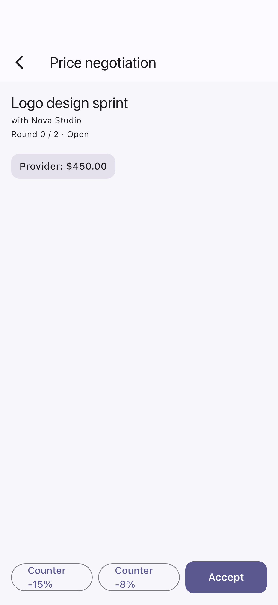
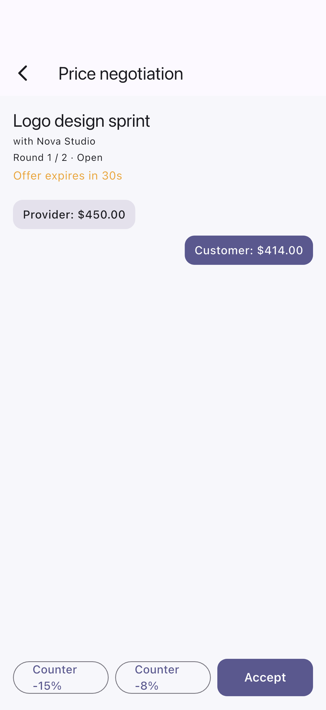
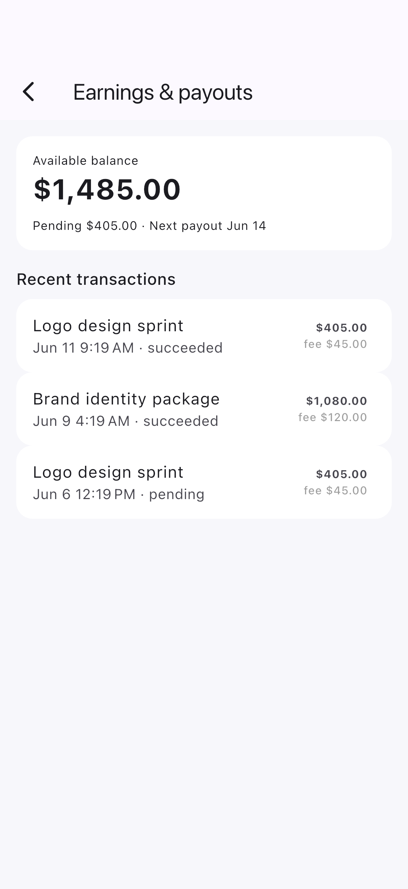

# flutter-stripe-connect-marketplace

Flutter POC for a multi-service on-demand marketplace built around Stripe Connect (Express accounts), platform fees, split payouts, and a real-time price negotiation engine.

## Demo

These are real iOS-Simulator captures of the running app, generated via an integration-test driver. See [FLOW.md](FLOW.md) for how they are produced.

| Marketplace | Provider detail | Negotiation |
| --- | --- | --- |
|  |  |  |
| Counter offer | Payout dashboard | |
|  |  | |


## What it shows

- Provider listing with Stripe Connect onboarding status (`created`, `pending`, `verified`, `rejected`) derived from the `account.updated` webhook signals.
- Service detail with negotiation entry point.
- Price negotiation engine: customer counter-offer, provider accept / decline / counter, max 2 rounds, 30s expiry per offer, full audit trail per booking.
- Checkout with `application_fee_amount` + `transfer_data[destination]` split: platform fee 10%, remainder transferred to `acct_xxx`.
- Provider earnings dashboard with payout summary (available, pending, next payout date).

## Stack

- Flutter + Dart
- Riverpod for state management
- intl for currency / date formatting
- Stripe Connect concepts (Express accounts, PaymentIntent split, transfers)

## Run

```bash
flutter pub get
flutter run
```

The POC ships with seeded mock data so no Stripe keys are required to render the flow end-to-end. For a real integration, plug in `flutter_stripe` on the client and an Express server that calls Stripe with `application_fee_amount` and `transfer_data[destination]`.

## Backend sketch

```
POST /payment-intent
  body: { amount, currency, connectedAccountId }
  -> stripe.paymentIntents.create({
       amount,
       currency,
       application_fee_amount: amount * 0.10,
       transfer_data: { destination: connectedAccountId },
     })

POST /connect/account
  -> stripe.accounts.create({ type: 'express' })

POST /connect/account-link
  -> stripe.accountLinks.create({ account, type: 'account_onboarding', ... })

POST /webhooks/stripe
  -> handle account.updated, payment_intent.succeeded, payout.* events
```

## Author

Built by Hau (`tranthienhau`).
